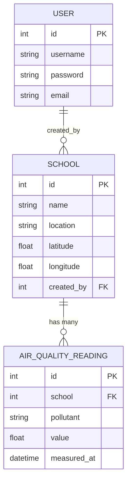
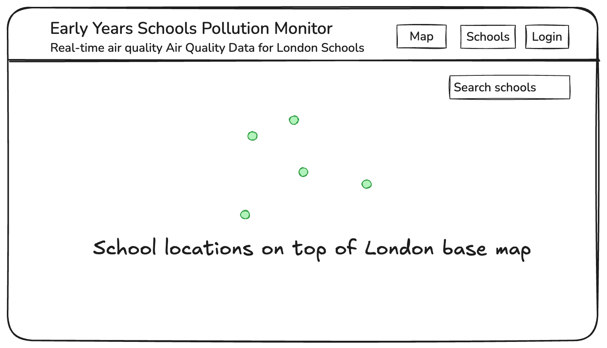
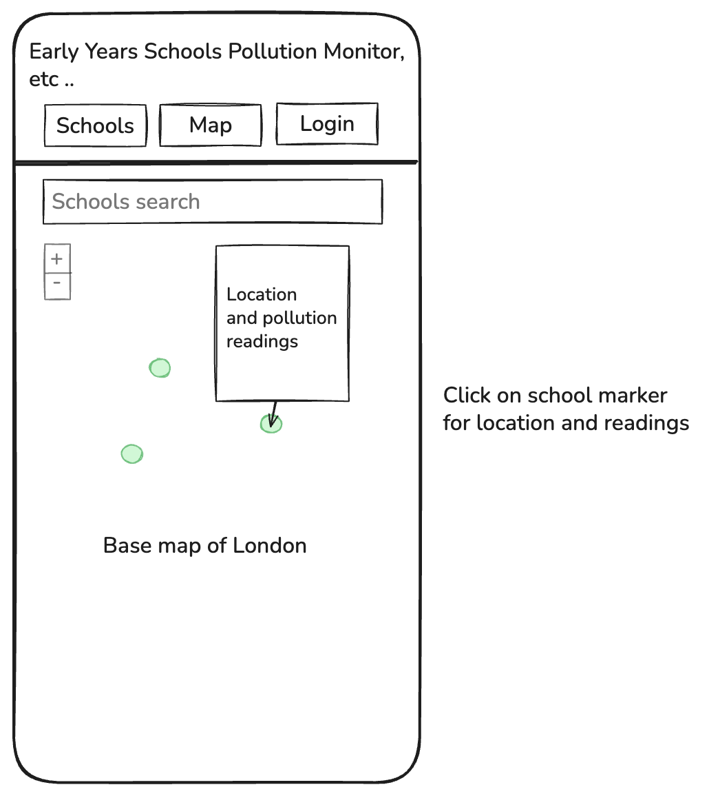
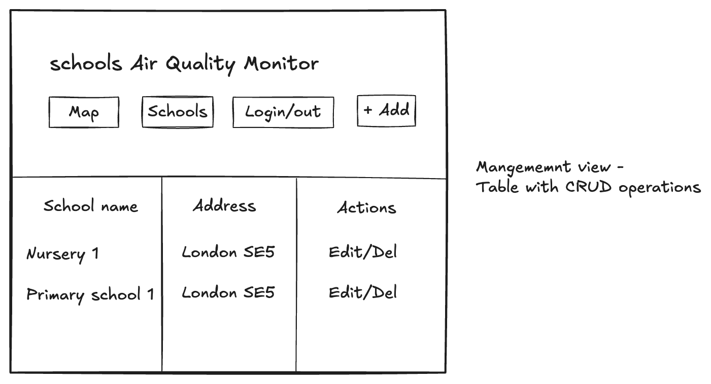
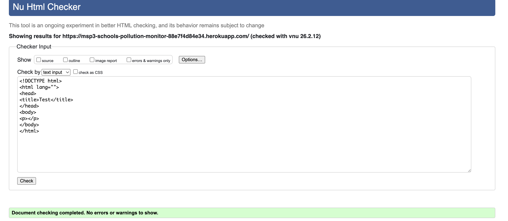
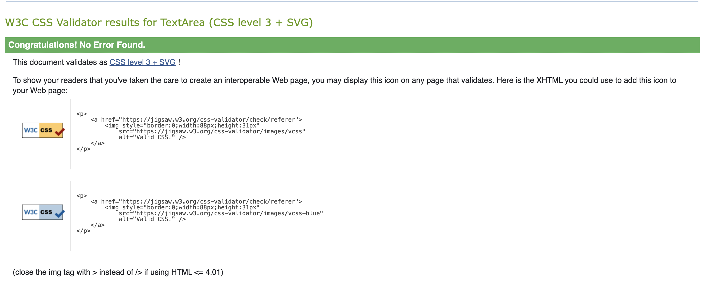

# Early Years Schools Pollution Monitor (MSP3)

A Django-based web application that monitors and visualizes real-time air quality data for early years schools in London. This interactive map displays PM10 and NO2 pollution levels using data from the OpenAQ API.

**Live Demo (Heroku):** [https://msp3-schools-pollution-monitor-88e7f4d84e34.herokuapp.com/](https://msp3-schools-pollution-monitor-88e7f4d84e34.herokuapp.com/)

**GitHub Repository:** [https://github.com/GavinKingcome/Schools_AirQuality_MSP3](https://github.com/GavinKingcome/Schools_AirQuality_MSP3)

---

## Table of Contents

- [About](#about)
- [Features](#features)
- [Database Schema](#database-schema)
- [Design Rationale](#design-rationale)
- [Screenshots](#screenshots)
- [Technologies Used](#technologies-used)
- [Installation](#installation)
- [Deployment](#deployment)
- [Security considerations](#security-considerations)
- [Usage](#usage)
- [User Stories](#user-stories)
- [Design & Wireframes](#design--wireframes)
- [Testing](#testing)
- [Known Limitations](#known-limitations)
- [Future Enhancements](#future-enhancements)
- [Credits](#credits)
- [License](#license)

---

## About

This is a **prototype application** developed as part of Code Institute's MSP3 (Milestone Project 3) to demonstrate backend development with Django/Python, RESTful API integration, database design, and interactive data visualization.

### Project Purpose

Air quality significantly impacts children's health and development. This application provides parents, school administrators, and researchers with accessible, real-time information about pollution levels at early years schools in London.

## Database Schema

### Entity Relationship Diagram



### Design Rationale

The database uses two custom models alongside Django's built-in User model:

**School** stores each monitored school's name, location, and coordinates. The `created_by` field links to the User who added the school, enabling ownership checks on edit and delete operations. Coordinates are stored as separate `latitude` and `longitude` float fields to support the Leaflet.js map integration.

**AirQualityReading** stores individual pollution measurements linked to a school via a foreign key. The `pollutant` field uses predefined choices (PM2.5, PM10, NO2, O3, SO2) to ensure data consistency. Readings are ordered by `measured_at` (most recent first) to support displaying the latest data. The `on_delete=CASCADE` relationship means that when a school is deleted, all its associated readings are automatically removed.

This structure supports the core requirement of displaying current air quality data per school on the map, while keeping the schema simple enough for the prototype scope. Future development would add models for historical trend data, user alerts, and multiple data sources.

### Project Goals

- ✅ Monitor real-time air quality (PM10 and NO2) at early years schools
- ✅ Provide accessible, visual data through an interactive map
- ✅ Demonstrate full-stack development skills with Django/Python
- ✅ Follow Test-Driven Development (TDD) practices
- ✅ Create a foundation for future production system

### Future Development

This prototype serves as a foundation for a more comprehensive system that will include:

- Migration to **PostgreSQL** and **TimescaleDB** for time-series data
- Integration with **London Air Quality Network (LAQN)** for more localized data
- Historical data analysis and trend visualization
- Statistical analysis and predictive modeling
- Email alert system for poor air quality events
- Expanded school coverage across Greater London

---

## Features

### Current Implementation (v1.0)

- **Interactive Map** - Leaflet.js-powered map centered on London/Camberwell
- **6 Schools** - Early years schools in Camberwell/Peckham area
- **Color-Coded Markers** - Visual indicators based on UK Air Quality Index
- **School Search** - Autocomplete dropdown to find schools quickly
- **Detailed Popups** - Click markers to see specific PM10 and NO2 levels
- **Responsive Design** - Works on desktop, tablet, and mobile devices
- **Data Freshness** - Only displays readings from the last 7 days
- **Real-time Data** - Live pollution readings from OpenAQ API
- **Full CRUD Operations** - Create, Read, Update, Delete schools (authentication required)
- **User Authentication** - Login-protected school management
- **Form Validation** - Comprehensive validation for all user inputs
- **Custom Error Pages** - Professional 404 and 500 error pages
- **Enhanced Admin Interface** - Easy navigation from admin to main site

### Air Quality Standards (UK Index)

**PM10 Levels:**

- Good: 0-20 µg/m³
- Moderate: 21-40 µg/m³
- Poor: 41-50 µg/m³
- Very Poor: 50+ µg/m³

**NO2 Levels:**

- Good: 0-40 µg/m³
- Moderate: 41-100 µg/m³
- Poor: 101-200 µg/m³
- Very Poor: 200+ µg/m³

---

## CRUD Functionality

This application provides full **CRUD (Create, Read, Update, Delete)** operations for school management.

### Features Implemented:

#### **READ (View Data)**

- **Interactive Map View** (`/`) - View all schools on Leaflet map with pollution markers
- **School List View** (`/schools/`) - Table view of all schools with details
- **Color-coded Air Quality** - Visual indicators (Green = Good, Orange = Moderate, Red = Poor)

#### **CREATE (Add New Schools)**

- **Add School Form** (`/schools/add/`) - Form to add new schools
- **Required Fields**: School name, full address, latitude, longitude
- **Form Validation**: All fields validated, coordinates must be valid decimals
- **User Feedback**: Success messages after adding schools
- **Authentication Required**: Only logged-in users can add schools

#### **UPDATE (Edit Existing Schools)**

- **Edit School Form** (`/schools/<id>/edit/`) - Modify school details
- **Pre-populated Form**: Existing data auto-filled for easy editing
- **Same Validation**: Ensures data quality on updates
- **Success Messages**: Confirmation after successful edits
- **Authentication Required**: Only logged-in users can edit schools

#### **DELETE (Remove Schools)**

- **Delete Confirmation Page** (`/schools/<id>/delete/`) - Safety confirmation before deletion
- **Warning Display**: Shows number of pollution readings that will be deleted
- **Cascade Delete**: Automatically removes associated pollution data
- **Cancel Option**: Can abort deletion and return to school list
- **Authentication Required**: Only logged-in users can delete schools

| Action           | Public Users | Authenticated Users | Owner Only |
| ---------------- | ------------ | ------------------- | ---------- |
| View Map         | ✅ Yes       | ✅ Yes              | —          |
| View School List | ✅ Yes       | ✅ Yes              | —          |
| Add School       | ❌ No        | ✅ Yes              | —          |
| Edit School      | ❌ No        | ❌ No               | ✅ Yes     |
| Delete School    | ❌ No        | ❌ No               | ✅ Yes     |

### How to Use:

1. **View Schools**: Visit `/` for map or `/schools/` for list (no login required)
2. **Login**: Click "Login" or "Sign Up" in the navigation bar
3. **Add School**: Click "Add New School" button or visit `/schools/add/`
4. **Edit School**: Click "Edit" button next to any school in the list
5. **Delete School**: Click "Delete" button → Confirm deletion

### Form Validation:

- ✅ All fields are required
- ✅ Coordinates must be valid decimal numbers
- ✅ School names validated for uniqueness
- ✅ Address format validated
- ✅ Real-time error messages displayed

### User Experience Features:

- **Responsive Design**: Works on mobile, tablet, and desktop
- **Professional Styling**: Clean, modern UI with consistent branding
- **Success/Error Messages**: Clear feedback for all actions
- **Navigation**: Easy movement between map, list, and forms
- **Help Section**: Instructions for finding coordinates on Google Maps

### Technical Implementation:

- **Django Forms**: ModelForm with custom widgets and validation
- **View Logic**: Function-based views with decorators
- **Template Inheritance**: Consistent navigation across all pages
- **CSRF Protection**: Secure form submissions
- **Messages Framework**: Django's built-in messaging for user feedback
- **Login Required Decorator**: Authentication enforcement for CUD operations

<!-- Add this after your existing CRUD section and before Screenshots -->

## Error Handling

### Custom Error Pages

The application includes professional, user-friendly error pages that maintain branding and provide helpful navigation when things go wrong.

#### **404 Page Not Found**

- **Custom branded design** matching site theme
- **Helpful message**: "The page you're looking for seems to have wandered off the map"
- **Navigation buttons** to return to Map or School List
- **Responsive layout** for all devices

**When it appears:** Visiting non-existent URLs (e.g., `/random-page/`)

#### **500 Server Error**

- **User-friendly message** without technical jargon
- **Reassurance** that the issue is being addressed
- **Navigation options**: "Go Back" and "Home" buttons
- **Professional appearance** maintains user trust

**When it appears:** Server-side errors (automatically logged for developers)

### Enhanced Admin Interface

The Django admin interface has been customized for better user experience:

#### **Custom Navigation**

- **Quick access buttons** in admin header
  - 🗺️ "View Map" - Return to main map view
  - 📋 "Manage Schools" - Go to school list
- **Consistent branding** across admin and public pages
- **Seamless navigation** between admin and main site

#### **Fixed Admin Logout**

- **Custom logout view** handles both GET and POST requests
- **No 405 errors** - smooth logout experience
- **Redirects to map** with success message
- **URL interception** prevents Django admin logout issues

### Technical Implementation

**Error Page Setup:**

```
monitoring/templates/
├── 404.html          # Custom Page Not Found template
├── 500.html          # Custom Server Error template
└── admin/
    └── base_site.html  # Custom admin header
```

**Security Features:**

- ✅ DEBUG disabled in production (Heroku)
- ✅ Error pages don't expose sensitive information
- ✅ Proper error logging for developers
- ✅ User-friendly messages for end users

**Admin Customization:**

- ✅ Custom template extends Django's admin base
- ✅ Override branding and navigation blocks
- ✅ Custom logout URL route to prevent errors
- ✅ Styled to match site theme

---

## Screenshots

### Desktop View


_Interactive map showing color-coded school markers and detailed popup_

### Mobile View


_Responsive design optimized for mobile devices_

### School Detail Popup


_Detailed air quality information with color-coded status indicators_

---

## UX Design

### Design Philosophy

The Early Years Schools Pollution Monitor was designed with **simplicity, accessibility, and data clarity** in mind:

- **Mobile-first responsive design** - Ensures usability across all devices
- **Clear visual hierarchy** - Professional blue gradient header with intuitive navigation
- **Intuitive data visualization** - Color-coded markers for instant air quality assessment
- **Real-time search** - Interactive search highlights matching schools dynamically
- **Accessibility** - High contrast ratios, touch-friendly buttons, semantic HTML

---

### User Stories

#### **As a Parent/Guardian:**

- ✅ I want to quickly see air quality levels near schools so I can make informed decisions about my child's exposure
- ✅ I want to search for specific schools to check their current air quality readings
- ✅ I want clear visual indicators (colors) so I can understand air quality at a glance without technical knowledge
- ✅ I want the site to work on my mobile phone while I'm on the go

#### **As a School Administrator:**

- ✅ I want to add new schools to the monitoring system
- ✅ I want to update school information easily when addresses change
- ✅ I want to view all monitored schools in one organized list
- ✅ I want to remove schools that are no longer relevant

#### **As a Researcher/Environmental Analyst:**

- ✅ I want to see detailed PM10 and NO₂ levels for each school location
- ✅ I want to compare air quality across different schools and areas
- ✅ I want access to recent, reliable data from the OpenAQ API
- ✅ I want to identify schools in areas with poor air quality for further study

---

### Color Scheme

Air quality indicators follow **UK DEFRA (Department for Environment, Food & Rural Affairs)** standards:

| Color                   | Air Quality Level | PM10 Range  | NO₂ Range    | Meaning                                                              |
| ----------------------- | ----------------- | ----------- | ------------ | -------------------------------------------------------------------- |
| 🟢 **Green** (#00a651)  | Good              | ≤20 µg/m³   | ≤40 µg/m³    | Low pollution, suitable for all outdoor activities                   |
| 🟠 **Orange** (#ffa500) | Moderate          | 21-40 µg/m³ | 41-100 µg/m³ | Acceptable quality, some sensitive individuals may experience issues |
| 🔴 **Red** (#d32f2f)    | Very Poor         | >50 µg/m³   | >200 µg/m³   | Health warnings, everyone may experience effects                     |

**Header Colors:**

- Primary blue: `#1e3a8a` to `#3b82f6` (gradient)
- Logout button: `#dc2626` (red)
- Login button: `#059669` (green)

---

### Typography & Spacing

- **Font Family**: System fonts (`-apple-system, BlinkMacSystemFont, 'Segoe UI', Roboto`) for optimal performance
- **Responsive Text**: Scales appropriately across all screen sizes
- **Touch Targets**: Minimum 44×44px for mobile usability (WCAG 2.1 AAA)
- **Consistent Spacing**: Uses rem units for scalability

---

### Wireframes

#### 1. Desktop Map View



**Key Features:**

- Full-width interactive map with color-coded school markers
- Search box positioned top-right for easy access
- Leaflet zoom controls top-left
- Professional blue gradient header with navigation
- Responsive layout adapts to browser width

---

#### 2. Mobile Map View



**Responsive Adjustments:**

- Search box expands to full-width at top of map
- Zoom controls repositioned 70px below search to avoid overlap
- Map height adjusted for optimal mobile viewing
- Touch-friendly navigation buttons
- Stacked layout for smaller screens

---

#### 3. School Management View



**Features:**

- Table/card layout displaying all monitored schools
- "Add School" button prominently placed
- Edit/Delete actions for each school entry
- Consistent header and navigation across all pages
- Responsive table design for mobile devices

---

### Accessibility Considerations

- **Keyboard Navigation**: All interactive elements are fully keyboard-accessible
- **Color Contrast**: Meets WCAG AA standards for text and UI components
- **Touch Targets**: Minimum 44×44px tap targets for mobile usability
- **Focus Indicators**: Clear visual feedback when navigating with keyboard
- **Semantic HTML**: Proper heading hierarchy and ARIA labels where needed
- **Responsive Images**: Wireframes and map markers scale appropriately

### Accessibility Testing

The following checks were performed on the deployed site:

- **Form Labels**: All form inputs (login, signup, add/edit school) have associated `<label>` elements linked via `for` attributes
- **Keyboard Navigation**: All pages can be navigated using Tab and Shift+Tab, including the navigation bar, form fields, and action buttons
- **Focus States**: Interactive elements show visible focus outlines when navigated via keyboard (blue box-shadow on form inputs, browser default outlines on links and buttons)
- **Colour Contrast**: Header text (white on blue gradient) and body text (dark on white) meet WCAG AA contrast requirements
- **Semantic HTML**: Pages use `<header>`, `<nav>`, `<main>`, and `<footer>` elements for proper document structure
- **Form Feedback**: Error messages are displayed inline next to the relevant field, and success messages appear in a visible banner below the header

---

### Responsive Breakpoints

```css
/* Mobile: < 480px */
/* Tablet: 481px - 768px */
/* Desktop: > 768px */
```

**Mobile-specific optimizations:**

- Full-width search input with `box-sizing: border-box`
- Adjusted map height for better viewing
- Repositioned zoom controls to prevent overlap
- Touch-friendly button sizes (min 44px)

---

### Future UX Enhancements

- [ ] Filtering by air quality level (show only "Poor" or "Very Poor" schools)
- [ ] Data export functionality (CSV/PDF reports)
- [ ] Historical data charts for each school location
- [ ] Email/SMS alerts for poor air quality readings
- [ ] Dark mode theme option
- [ ] Multi-language support (starting with common London languages)
- [ ] Comparison view (side-by-side school air quality)

## Technologies Used

### Backend

- **Python 3.12** - Programming language
- **Django 5.1.3** - Web framework
- **Django Forms** - Form handling and validation ✨ NEW
- **Django Authentication** - User login and permissions ✨ NEW
- **Django Messages Framework** - User feedback system ✨ NEW
- **SQLite3** - Database (development/prototype)
- **Requests** - HTTP library for API calls

### Frontend

- **HTML5/CSS3** - Structure and styling
- **JavaScript (ES6)** - Interactive functionality
- **Leaflet.js 1.9.4** - Interactive mapping library
- **OpenStreetMap** - Map tiles and data

### APIs & Data Sources

- **OpenAQ API** - Real-time air quality data
- **Attribution**: Data provided by OpenAQ platform

### Development Tools

- **Git/GitHub** - Version control
- **VS Code** - IDE
- **Chrome DevTools** - Testing and debugging
- **Python unittest** - Test framework
- **Figma** - Wireframing and UI design

---

## Installation & Setup

### Prerequisites

- Python 3.8 or higher
- pip (Python package manager)
- Git

### Local Development Setup

1. **Clone the repository**

   ```bash
   git clone https://github.com/yourusername/Schools_AirQuality_MSP3.git
   cd Schools_AirQuality_MSP3
   ```

2. **Create virtual environment**

   ```bash
   python3 -m venv venv
   source venv/bin/activate  # On Windows: venv\Scripts\activate
   ```

3. **Install dependencies**

   ```bash
   pip install -r requirements.txt
   ```

4. **Set up database**

   ```bash
   python manage.py migrate
   ```

5. **Load initial school data**

   ```bash
   python manage.py shell
   # Run the school creation script (see docs/setup.md)
   ```

6. **Fetch air quality data**

   ```bash
   python manage.py shell
   # Run the OpenAQ data fetch script (see docs/api_usage.md)
   ```

7. **Run development server**

   ```bash
   python manage.py runserver
   ```

8. **Access the application**
   Open browser to `http://127.0.0.1:8000/`

## Deployment

This project is deployed on [Heroku](https://heroku.com). Follow these steps to deploy your own instance.

### Prerequisites

- A [Heroku account](https://signup.heroku.com/)
- [Heroku CLI](https://devcenter.heroku.com/articles/heroku-cli) installed
- Git installed and project committed to a repository

### 1. Create a Heroku App

```bash
heroku login
heroku create schools_airquality_msp3
```

### 2. Set Configuration Variables

Set the required environment variables on Heroku (see `.env.example` for reference):

```bash
heroku config:set SECRET_KEY="your-secret-key-here"
heroku config:set DEBUG="False"
heroku config:set OPEN_AQ_API_KEY="your-openaq-api-key"
```

> **Note:** `DATABASE_URL` is automatically set when the Heroku PostgreSQL add-on is provisioned.

### 3. Verify Configuration Files

Ensure the following files are present and correctly configured:

- **Procfile** — tells Heroku how to run the app: `web: gunicorn schools_airquality_MSP3.wsgi`
- **runtime.txt** — specifies Python version: `python-3.12.0`
- **requirements.txt** — all dependencies including `gunicorn`, `dj-database-url`, `whitenoise`, and `python-dotenv`
- **settings.py** — `SECRET_KEY` loaded from environment variable, `DEBUG` set to `False` in production, `ALLOWED_HOSTS` includes `.herokuapp.com`

### 4. Deploy to Heroku

```bash
heroku git:remote -a your-app-name
git add .
git commit -m "Prepare for Heroku deployment"
git push heroku main
```

### 5. Set Up the Database

```bash
heroku run python manage.py migrate
heroku run python manage.py createsuperuser
```

### 6. Collect Static Files

Static files are collected automatically during deployment via WhiteNoise. If needed, run manually:

```bash
heroku run python manage.py collectstatic --noinput
```

### 7. Verify Deployment

```bash
heroku open
```

**Check the following on the live site:**

- Home page loads with interactive map
- School markers display with air quality data
- Signup, login, and logout work correctly
- Add, edit, and delete school functions work for authenticated users
- Ownership checks prevent editing/deleting other users' schools
- Static files (CSS, JavaScript) load correctly
- DEBUG is off (no detailed error pages shown to users)

### 8. Fetch Air Quality Data (if needed)

```bash
heroku run python manage.py fetch_air_quality
```

---

## Security Considerations

### Secret Key Management

The Django `SECRET_KEY` is stored as an environment variable, not in the codebase. A `.env.example` file documents the required environment variables without exposing actual values. Locally, `python-dotenv` loads variables from a `.env` file which is excluded from version control via `.gitignore`.

### Authentication

User authentication is handled through Django's built-in auth framework. Users can sign up, log in, and log out through dedicated user-facing pages — the Django admin login is not used for regular users. The `@login_required` decorator protects all create, edit, and delete operations.

### Authorisation and Ownership

Ownership checks ensure users can only edit or delete schools they created. Each school has a `created_by` field linked to the user who added it. If a user attempts to modify another user's school, they are redirected with an error message.

### CSRF Protection

All forms include Django's `` template tag, and the `CsrfViewMiddleware` is active in the middleware stack. This prevents cross-site request forgery attacks on form submissions.

### DEBUG Setting

`DEBUG` is set to `False` in production via an environment variable, ensuring that sensitive information such as stack traces, settings, and database queries are never exposed to end users. Custom 404 and 500 error pages are displayed instead.

### ALLOWED_HOSTS

The `ALLOWED_HOSTS` setting restricts which domains can serve the application, preventing HTTP Host header attacks. Only `localhost`, `127.0.0.1`, and the Heroku app domain are permitted.

## Usage

### Viewing Air Quality Data

1. **Browse the Map** - Pan and zoom to explore the area
2. **Click School Markers** - View detailed pollution information
3. **Use Search** - Type school name in the search box to quickly locate
4. **Check Color Coding** - Marker colors indicate overall air quality status

### Understanding the Data

- **Overall Status**: Based on the worst pollutant (PM10 or NO2)
- **Individual Readings**: Each pollutant shown with its own status
- **Data Age**: Only readings from the last 7 days are displayed

---

## User Stories

This project follows Agile methodology with user stories developed for each feature. User stories guided the development process and were implemented using Test-Driven Development (TDD) where applicable.

### User Personas

**Parents & Guardians**

- Monitor air quality near their child's school
- Understand if pollution levels are safe
- Access information easily on mobile devices

**School Administrators**

- Track pollution levels over time
- Compare air quality with nearby schools
- Receive clear visual indicators

**Environmental Health Researchers**

- Access reliable, real-time pollution data
- Identify schools in high-pollution areas
- Analyze trends across multiple locations

**Developers & Maintainers**

- Write clean, maintainable code
- Implement comprehensive testing
- Follow Django best practices

### Implementation Status

**MSP3 v1.0 (Prototype):** 14/20 user stories complete ✅

- ✅ Core features: Map, search, real-time data, responsive design
- ⬜ Future features: Automated updates, historical charts, alerts

**[📄 View Complete User Stories with Acceptance Criteria & Tasks →](User_Stories.md)**

---

## Design & Wireframes

Wireframes were created in Figma to plan the user interface and user experience before development. The wireframes include three key views: desktop map, mobile responsive layout, and popup detail.

### Design Evolution

**Changes from wireframe to final implementation:**

- ✅ Removed legend box (information moved to popups for cleaner UI)
- ✅ Changed bright yellow to orange for better contrast on white map background
- ✅ Added gradient header (#0078a8 to #005f87) for professional appearance
- ✅ Enhanced popup styling with color-coded sections and gray backgrounds
- ✅ Improved mobile spacing to prevent UI element overlap
- ✅ Increased marker sizes for better touch targeting on mobile devices

---

## Testing

### Test-Driven Development (TDD)

This project follows TDD principles with comprehensive unit tests for backend functionality.

> **Note:** API integration tests were initially written using TDD but were removed during refactoring as the fetch command architecture changed from individual functions to a single management command. Future development would include updated integration tests for the v3 API.

````

**Run all tests:**

```bash
python manage.py test
````

**Run specific test:**

```bash
python manage.py test monitoring.tests.SchoolModelTest
```

### Test Coverage

| Component               | Tests          | Status      |
| ----------------------- | -------------- | ----------- |
| School Model            | 5 unit tests   | ✅ Passing  |
| AirQualityReading Model | 7 unit tests   | ✅ Passing  |
| Statistical Methods     | 7 unit tests   | ✅ Passing  |
| Map View                | 4 unit tests   | ✅ Passing  |
| Search Functionality    | Manual testing | ✅ Verified |
| Responsive Design       | Manual testing | ✅ Verified |

**Total Automated Tests:** 23 passing ✅

**Manual Testing:** All features tested on desktop, tablet (768px), mobile (320px) ✅

### Manual Testing Checklist

**Map & Display:**

- [x] Map loads correctly
- [x] All 6 schools display as markers
- [x] Markers show correct colors based on pollution levels
- [x] Search box autocomplete works
- [x] Clicking markers opens popups with correct data
- [x] Mobile responsive design works (320px, 768px, 1024px)
- [x] Attribution links work
- [x] Data freshness filter (7 days) working

**CRUD Operations:** ✨ NEW

- [x] View school list shows all schools in table format
- [x] Add school form validates all required fields
- [x] Add school creates new entry in database
- [x] Edit school pre-populates form with existing data
- [x] Edit school updates database correctly
- [x] Delete school shows confirmation page
- [x] Delete school removes entry and associated readings
- [x] Success messages display after each operation
- [x] Login required for Create/Update/Delete operations
- [x] Public users can view map and school list

**Error Handling:** ✨ NEW

- [x] Custom 404 page displays for non-existent URLs
- [x] Custom 500 page displays for server errors
- [x] 404 page includes navigation back to site
- [x] Error pages match site branding
- [x] Admin logout works without 405 errors
- [x] Admin navigation buttons work correctly

### Code Validation

All code has been validated using industry-standard validators to ensure quality and standards compliance.

#### HTML Validation (W3C Nu Html Checker)

All HTML pages validated using the [W3C Markup Validation Service](https://validator.w3.org/).

**Method:** Validate by URI (fetches rendered Django templates from live Heroku site)

**Pages Validated:**

- ✅ Map View (Landing Page) - `https://msp3-schools-pollution-monitor-88e7f4d84e34.herokuapp.com/`
- ✅ School List - `/schools/`
- ✅ Add School Form - `/schools/add/`
- ✅ Login Page - `/login/`
- ✅ Signup Page - `/signup/`

**Result:** ✅ **No errors or warnings** - Document checking completed successfully

**Key Fixes Applied:**

- Ensured `<!DOCTYPE html>` is first element (Django template load tags moved)
- Removed trailing slashes from void elements (`<meta>`, `<link>`, `<input>`)
- Proper HTML5 structure maintained


_W3C HTML Validator - No errors or warnings found_

#### CSS Validation (W3C CSS Validator)

CSS validated using the [W3C CSS Validation Service](https://jigsaw.w3.org/css-validator/).

**File Validated:**

- ✅ `static/assets/css/style.css` - Custom stylesheet

**Method:** Validate by direct input

**Result:** ✅ **Valid CSS** - No errors found

**Note:** External libraries (Leaflet CSS) not validated as they are third-party maintained.


_W3C CSS Validator - Valid CSS with no errors_

#### Python Code Quality (PEP8)

Python code follows PEP 8 style guidelines.

**Files Checked:**

- ✅ `monitoring/views.py` - All view functions
- ✅ `monitoring/models.py` - Model definitions
- ✅ `monitoring/forms.py` - Form classes
- ✅ `management/commands/fetch_air_quality.py` - Data fetching command

**Result:** ✅ No significant PEP 8 violations

---

## Current School Coverage

**6 Schools in Camberwell/Peckham Area:**

1. Lyndhurst Primary School
2. Brunswick Park Primary School
3. Bellenden Primary School
4. The Grove Nursery School
5. Dog Kennel Hill Primary School
6. Bessemer Grange Primary School

All schools located within ~1.5km of Camberwell air quality monitoring stations.

---

## Data Sources & Attribution

- **Air Quality Data**: [OpenAQ](https://openaq.org) - Open-source air quality data platform
- **Map Tiles**: [OpenStreetMap](https://www.openstreetmap.org/copyright) contributors
- **Mapping Library**: [Leaflet.js](https://leafletjs.com)

### Data Limitations

- Data freshness: Only readings from last 7 days are displayed
- Coverage: Limited to areas with OpenAQ monitoring stations
- Update frequency: Dependent on OpenAQ data availability
- This is a **prototype** - not for critical decision-making

---

## Known Limitations (MSP3 Prototype)

- **Manual Data Refresh** - Requires running Django shell script to fetch new data
- **SQLite Database** - Not suitable for production (will migrate to PostgreSQL)
- **Limited Coverage** - Only 6 schools in Camberwell (prototype scope)
- **No Historical Visualization** - Statistical methods exist but not displayed in UI
- **No Automated Updates** - Data fetching not scheduled (will add cron jobs)
- **Basic Error Logging** - No monitoring dashboard (Phase 2)
- **Shared Readings** - Schools within the same area share readings from the nearest OpenAQ monitoring station, so values may be identical across nearby schools

---

## Future Enhancements

- [ ] **Database caching with scheduled updates**
  - Store air quality readings in database
  - Use `fetch_air_quality` management command
  - Schedule with Heroku Scheduler (hourly/daily)
  - Improves page load speed
  - Reduces API dependency

### Database & Infrastructure

- [ ] Migrate to PostgreSQL
- [ ] Implement TimescaleDB for time-series data
- [ ] Set up automated backups
- [ ] Deploy to cloud platform

### Data Collection

- [ ] Integrate with London Air Quality Network (LAQN)
- [ ] Create Django management command for automation
- [ ] Set up cron job for automatic updates
- [ ] Email notifications for data fetch failures

### Analytics & Visualization

- [ ] Add statistics panel to popups (7-day averages, peaks)
- [ ] Create interactive charts (Chart.js) for historical trends
- [ ] Heatmap visualization
- [ ] Comparison tools between schools

### User Features

- [ ] Email alerts for poor air quality
- [ ] User accounts and favorites
- [ ] Export data as CSV/PDF
- [ ] Share functionality

### Expansion

- [ ] Add 50+ schools across London
- [ ] Multiple cities support
- [ ] Additional pollutants (SO2, O3, CO)
- [ ] Public API for researchers

**[View Detailed Phase 2 Plans →](User_Stories.md#future-enhancements-phase-2---production-version)**

---

## Credits & Acknowledgments

**Development & Mentorship:**

- **Victor Miklovich** - Mentor, for invaluable guidance and support
- **Code Institute** - Project guidance and curriculum

**Data & Tools:**

- **OpenAQ** - Free, open-source air quality data
- **OpenStreetMap Contributors** - Map data
- **Leaflet.js** - Mapping library
- **Django Community** - Excellent documentation and support
- **GitHub Copilot** - Development assistance and debugging support

---

## Author

**Gavin Kingcome**

- GitHub: [@gavinkingcome](https://github.com/GavinKingcome)
- Project Link: [https://github.com/GavinKingcome/Schools_AirQuality_MSP3](https://github.com/GavinKingcome/Schools_AirQuality_MSP3)

---

**Note**: This is a prototype educational project. Air quality data should not be used for critical health or safety decisions. Always refer to official government sources for actionable air quality information.

---

_Last Updated: February 2026_  
_MSP3 - Code Institute Full Stack Software Development_
